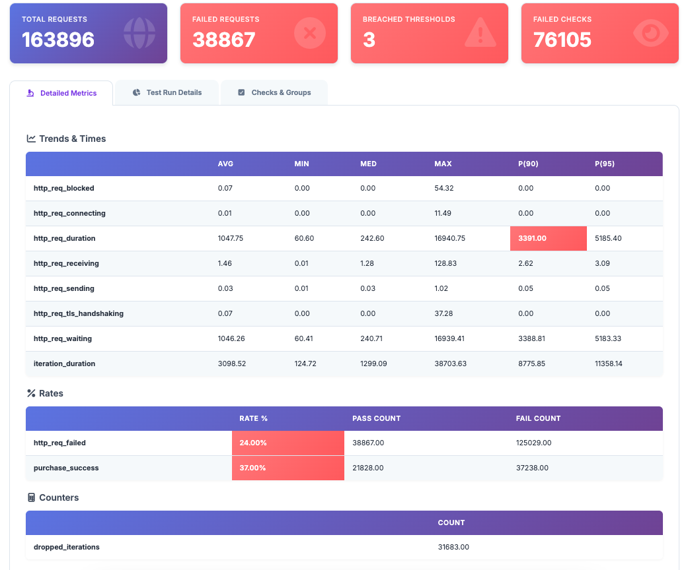

# Análise de Resultados - Teste de Carga (Load Test)

## Resumo Executivo

O teste de carga foi executado com **500 usuários virtuais** (VUs) e apresentou resultados que indicam problemas significativos de performance e confiabilidade na aplicação testada.

### Status Geral: ⚠️ **CRÍTICO**

- **Total de Requisições**: 163,896
- **Requisições Falhadas**: 38,867 (24%)
- **Thresholds Violados**: 3
- **Checks Falhados**: 76,105

---

## Métricas Principais

### Requisições HTTP

| Métrica | Valor |
|---------|-------|
| Total de Requisições | 163,896 |
| Taxa de Requisições | 321.36/s |
| Requisições Falhadas | 38,867 (24.00%) |
| Requisições Bem-sucedidas | 125,029 (76.00%) |

### Performance de Resposta

| Métrica | Valor | Status |
|---------|-------|--------|
| **Tempo Médio de Resposta** | 1,047.75 ms | ⚠️ Alto |
| **Tempo Mínimo** | 60.60 ms | ✅ Bom |
| **Tempo Mediano (P50)** | 242.60 ms | ✅ Aceitável |
| **Tempo Máximo** | 16,940.75 ms | 🔴 Crítico |
| **Percentil 90 (P90)** | 3,391.00 ms | 🔴 **FALHOU** |
| **Percentil 95 (P95)** | 5,185.40 ms | 🔴 Crítico |

**Observação**: O P90 de 3,391ms indica que 10% das requisições demoraram mais de 3.4 segundos, violando provavelmente um threshold de performance.

### Duração da Iteração

| Métrica | Valor |
|---------|-------|
| Duração Média | 3,098.52 ms (3.1s) |
| Duração Mínima | 124.72 ms |
| Duração Mediana | 1,299.09 ms (1.3s) |
| Duração Máxima | 38,703.63 ms (38.7s) |
| P90 | 8,775.85 ms (8.8s) |
| P95 | 11,358.14 ms (11.4s) |

---

## Análise de Falhas

### Taxa de Falha por Tipo

1. **http_req_failed**: 24.00% (38,867 falhas)
   - Indica que quase 1 em cada 4 requisições HTTP falharam
   - Possíveis causas: timeouts, erros 5xx, problemas de rede

2. **purchase_success**: 37.00% de sucesso (63% de falha)
   - Apenas 37% das tentativas de compra foram bem-sucedidas
   - **CRÍTICO**: Mais da metade das transações falharam
   - Total de tentativas: 59,066
   - Sucessos: 21,828
   - Falhas: 37,238

### Iterações Perdidas

- **Dropped Iterations**: 31,683
- Indica que muitas iterações não puderam ser completadas devido a problemas de performance ou timeouts

---

## Análise de Checks

### Resumo de Checks

| Check | Passou | Falhou | Taxa de Sucesso | Status |
|-------|--------|--------|-----------------|--------|
| homepage status is 200 | 57,437 | 1,629 | 97.24% | ⚠️ Aceitável |
| reserve status is 200 | 23,250 | 35,816 | 39.36% | 🔴 **CRÍTICO** |
| reserve page contains flights | 23,250 | 35,816 | 39.36% | 🔴 **CRÍTICO** |
| purchase status is 200 | 22,514 | 736 | 96.83% | ⚠️ Aceitável |
| purchase page loaded | 22,514 | 736 | 96.83% | ⚠️ Aceitável |
| confirmation status is 200 | 21,828 | 686 | 96.95% | ⚠️ Aceitável |
| purchase confirmed | 21,828 | 686 | 96.95% | ⚠️ Aceitável |

### Pontos Críticos Identificados

1. **Página de Reserva (Reserve)**: 
   - Taxa de falha de **60.64%** (35,816 falhas em 59,066 tentativas)
   - Este é o maior gargalo do sistema
   - A página não está retornando status 200 na maioria dos casos
   - Possíveis causas: sobrecarga do servidor, problemas no banco de dados, timeouts

2. **Homepage**: 
   - 97.24% de sucesso é aceitável, mas ainda há 1,629 falhas
   - Pode indicar problemas intermitentes

3. **Fluxo de Compra**:
   - Embora a taxa de sucesso seja alta (96%+), o número absoluto de falhas ainda é significativo
   - 686 falhas na confirmação final podem representar perda de receita

---

## Análise de Throughput

### Requisições e Iterações

- **Taxa de Requisições**: 321.36/s
- **Taxa de Iterações**: 115.81/s
- **Total de Iterações**: 59,066
- **Iterações Perdidas**: 31,683 (35% de perda)

### Transferência de Dados

- **Dados Recebidos**: 784.61 MB (1.54 MB/s)
- **Dados Enviados**: 26.40 MB (0.05 MB/s)

---

## Análise de Tempos de Resposta por Componente

### Breakdown de Tempo HTTP

| Componente | Tempo Médio | Observação |
|------------|-------------|------------|
| **http_req_waiting** | 1,046.26 ms | Tempo de espera do servidor (maior componente) |
| **http_req_duration** | 1,047.75 ms | Tempo total da requisição |
| **http_req_receiving** | 1.46 ms | Tempo de recebimento (baixo) |
| **http_req_sending** | 0.03 ms | Tempo de envio (muito baixo) |
| **http_req_blocked** | 0.07 ms | Tempo bloqueado (baixo) |
| **http_req_connecting** | 0.01 ms | Tempo de conexão (baixo) |
| **http_req_tls_handshaking** | 0.07 ms | Handshake TLS (baixo) |

**Conclusão**: O problema principal está no **tempo de processamento do servidor** (waiting time), não na rede ou na conexão.

---

## Thresholds Violados

O relatório indica que **3 thresholds foram violados**:

1. Provavelmente relacionado ao **P90 de http_req_duration** (3,391ms)
2. Possivelmente relacionado à **taxa de falha de requisições** (24%)
3. Possivelmente relacionado à **taxa de sucesso de purchase** (37%)

---

## Conclusões

### Problemas Identificados

1. **🔴 CRÍTICO - Página de Reserva**:
   - Taxa de falha de 60.64%
   - Maior gargalo do sistema
   - Requer investigação imediata

2. **🔴 CRÍTICO - Performance de Resposta**:
   - P90 acima de 3 segundos
   - Tempos máximos de até 17 segundos
   - Experiência do usuário comprometida

3. **🔴 CRÍTICO - Taxa de Falha de Requisições**:
   - 24% de falha é inaceitável para produção
   - Indica problemas de estabilidade

4. **⚠️ ALTO - Taxa de Sucesso de Compra**:
   - Apenas 37% de sucesso
   - Impacto direto na receita
   - Perda de 37,238 transações

5. **⚠️ ALTO - Iterações Perdidas**:
   - 31,683 iterações não completadas
   - Indica problemas de capacidade

### Recomendações

1. **Imediato**:
   - Investigar e corrigir problemas na página de reserva
   - Otimizar queries de banco de dados
   - Aumentar capacidade do servidor ou implementar cache
   - Revisar timeouts e configurações de conexão

2. **Curto Prazo**:
   - Otimizar endpoints com maior latência
   - Implementar rate limiting adequado
   - Melhorar tratamento de erros e retry logic
   - Adicionar monitoramento em tempo real

3. **Médio Prazo**:
   - Implementar cache estratégico
   - Considerar CDN para assets estáticos
   - Revisar arquitetura para melhor escalabilidade
   - Implementar circuit breakers

4. **Testes Adicionais**:
   - Executar teste de stress para identificar ponto de quebra
   - Executar teste de endurance para verificar vazamentos de memória
   - Executar teste de spike para validar comportamento sob picos súbitos

---

## Métricas de Referência

Para uma aplicação web moderna, recomenda-se:
- **Tempo de resposta P90**: < 1 segundo
- **Taxa de erro HTTP**: < 1%
- **Taxa de sucesso de transações críticas**: > 99%

O sistema atual está **significativamente abaixo** desses benchmarks.

---

**Data da Análise**: Baseado no relatório HTML gerado  
**Tipo de Teste**: Load Test  
**Cenário**: 500 VUs (usuários virtuais)

---

## Visualização dos Resultados

*Dashboard do K6 Performance Test Report mostrando os resultados do teste de carga com 163,896 requisições totais, 38,867 requisições falhadas (24%), 3 thresholds violados e 76,105 checks falhados.*

