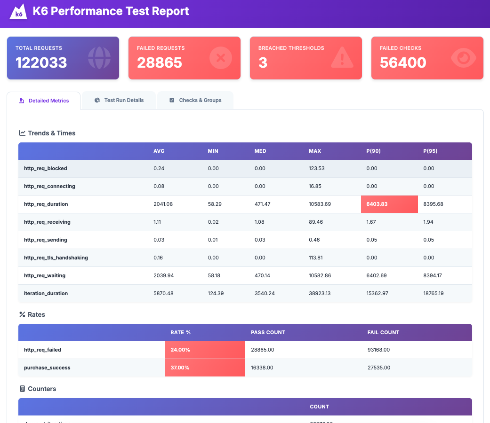

# Análise de Resultados - Teste de Spike (Spike Test)

## Resumo Executivo

O teste de **Spike Test** foi executado simulando um pico súbito de carga de **0 a 1000 usuários virtuais (VUs)**, testando a capacidade do sistema de lidar com aumentos abruptos de tráfego. Os resultados indicam que o sistema apresenta **sérias dificuldades** em lidar com picos de carga.

### Status Geral: ⚠️ **CRÍTICO**

- **Total de Requisições**: 122,033
- **Requisições Falhadas**: 28,865 (24%)
- **Thresholds Violados**: 3
- **Checks Falhados**: 56,400
- **Pico de VUs**: 1,000 usuários virtuais

---

## Características do Teste de Spike

### Perfil de Carga

| Métrica | Valor |
|---------|-------|
| **VUs Mínimas** | 0 |
| **VUs Máximas** | 1,000 |
| **Padrão de Carga** | Spike (pico súbito) |
| **Total de Iterações** | 43,873 |
| **Iterações Perdidas** | 28,876 (65.8% de perda) |
| **Taxa de Iterações** | 112.49/s |

**Observação**: Um teste de spike simula um aumento abrupto e significativo de carga, similar a eventos como promoções relâmpago, lançamentos de produtos, ou eventos virais. O sistema deve ser capaz de escalar rapidamente e manter a estabilidade.

---

## Métricas Principais

### Requisições HTTP

| Métrica | Valor |
|---------|-------|
| Total de Requisições | 122,033 |
| Taxa de Requisições | 312.90/s |
| Requisições Falhadas | 28,865 (24.00%) |
| Requisições Bem-sucedidas | 93,168 (76.00%) |

### Performance de Resposta

| Métrica | Valor | Status |
|---------|-------|--------|
| **Tempo Médio de Resposta** | 2,041.08 ms (2.04s) | 🔴 Crítico |
| **Tempo Mínimo** | 58.29 ms | ✅ Bom |
| **Tempo Mediano (P50)** | 471.47 ms | ⚠️ Aceitável |
| **Tempo Máximo** | 10,583.69 ms (10.6s) | 🔴 Crítico |
| **Percentil 90 (P90)** | 6,403.83 ms (6.4s) | 🔴 **FALHOU** |
| **Percentil 95 (P95)** | 8,395.68 ms (8.4s) | 🔴 Crítico |

**Análise Crítica**: 
- O P90 de **6.4 segundos** é **quase o dobro** do observado no load test (3.4s)
- Indica que durante o pico, o sistema sofre degradação severa de performance
- 10% das requisições demoraram mais de 6 segundos, violando thresholds de performance

### Duração da Iteração

| Métrica | Valor |
|---------|-------|
| Duração Média | 5,870.48 ms (5.9s) |
| Duração Mínima | 124.39 ms |
| Duração Mediana | 3,540.24 ms (3.5s) |
| Duração Máxima | 38,923.13 ms (38.9s) |
| P90 | 15,362.97 ms (15.4s) |
| P95 | 18,765.19 ms (18.8s) |

**Observação**: As iterações demoraram quase **o dobro** do tempo em comparação ao load test, indicando que o sistema não consegue manter a performance sob picos súbitos.

---

## Análise de Falhas

### Taxa de Falha por Tipo

1. **http_req_failed**: 24.00% (28,865 falhas)
   - Mesma taxa de falha do load test
   - Indica que o sistema não piora significativamente em termos de taxa de erro durante picos
   - Porém, a **severidade** dos problemas aumenta (tempos de resposta muito maiores)

2. **purchase_success**: 37.00% de sucesso (63% de falha)
   - Taxa idêntica ao load test
   - Apenas 16,338 compras bem-sucedidas de 43,873 tentativas
   - **27,535 transações perdidas** durante o pico
   - Impacto financeiro significativo em eventos de alta demanda

### Iterações Perdidas

- **Dropped Iterations**: 28,876
- **Taxa de Perda**: 65.8% (muito alta!)
- **Comparação com Load Test**: 35% de perda
- **Análise**: O sistema perde quase **o dobro** de iterações durante picos, indicando problemas graves de capacidade

---

## Análise de Checks

### Resumo de Checks

| Check | Passou | Falhou | Taxa de Sucesso | Status |
|-------|--------|--------|-----------------|--------|
| homepage status is 200 | 42,543 | 1,330 | 96.97% | ⚠️ Aceitável |
| reserve status is 200 | 17,430 | 26,443 | 39.73% | 🔴 **CRÍTICO** |
| reserve page contains flights | 17,430 | 26,443 | 39.73% | 🔴 **CRÍTICO** |
| purchase status is 200 | 16,857 | 573 | 96.71% | ⚠️ Aceitável |
| purchase page loaded | 16,857 | 573 | 96.71% | ⚠️ Aceitável |
| confirmation status is 200 | 16,338 | 519 | 96.92% | ⚠️ Aceitável |
| purchase confirmed | 16,338 | 519 | 96.92% | ⚠️ Aceitável |

### Pontos Críticos Identificados

1. **Página de Reserva (Reserve)**: 
   - Taxa de falha de **60.27%** (26,443 falhas em 43,873 tentativas)
   - **CRÍTICO**: Mesmo problema identificado no load test, mas com impacto ainda maior durante picos
   - A página não consegue lidar com o aumento súbito de carga
   - Possíveis causas: 
     - Falta de cache adequado
     - Queries de banco de dados não otimizadas
     - Ausência de rate limiting inteligente
     - Falta de auto-scaling

2. **Homepage**: 
   - 96.97% de sucesso é aceitável, mas ainda há 1,330 falhas
   - Durante picos, mesmo a homepage sofre degradação

3. **Fluxo de Compra**:
   - Taxa de sucesso alta (96%+), mas números absolutos preocupantes
   - 519 falhas na confirmação final representam perda de receita

---

## Análise de Throughput

### Requisições e Iterações

- **Taxa de Requisições**: 312.90/s (similar ao load test: 321.36/s)
- **Taxa de Iterações**: 112.49/s (similar ao load test: 115.81/s)
- **Total de Iterações**: 43,873
- **Iterações Perdidas**: 28,876 (**65.8% de perda** - CRÍTICO)

**Análise**: Embora a taxa de requisições seja similar, a **taxa de perda de iterações é quase o dobro**, indicando que o sistema não consegue processar adequadamente durante picos.

### Transferência de Dados

- **Dados Recebidos**: 587.84 MB (1.51 MB/s)
- **Dados Enviados**: 21.18 MB (0.05 MB/s)

---

## Análise de Tempos de Resposta por Componente

### Breakdown de Tempo HTTP

| Componente | Tempo Médio | Observação |
|------------|-------------|------------|
| **http_req_waiting** | 2,039.94 ms | Tempo de espera do servidor (maior componente) |
| **http_req_duration** | 2,041.08 ms | Tempo total da requisição |
| **http_req_receiving** | 1.11 ms | Tempo de recebimento (baixo) |
| **http_req_sending** | 0.03 ms | Tempo de envio (muito baixo) |
| **http_req_blocked** | 0.24 ms | Tempo bloqueado (aumentou vs load test) |
| **http_req_connecting** | 0.08 ms | Tempo de conexão (aumentou vs load test) |
| **http_req_tls_handshaking** | 0.16 ms | Handshake TLS (aumentou vs load test) |

**Conclusão**: 
- O problema principal continua sendo o **tempo de processamento do servidor**
- Durante picos, há aumento nos tempos de conexão e bloqueio, indicando possível saturação de recursos de rede/conexão
- O sistema não consegue escalar adequadamente para lidar com o pico

---

## Comparação: Spike Test vs Load Test

| Métrica | Load Test | Spike Test | Diferença | Análise |
|---------|-----------|------------|-----------|---------|
| **Total Requisições** | 163,896 | 122,033 | -25.5% | Menos requisições devido a mais iterações perdidas |
| **Taxa de Falha HTTP** | 24% | 24% | 0% | Taxa similar, mas severidade maior |
| **P90 http_req_duration** | 3,391ms | 6,404ms | +88.7% | **Quase o dobro!** |
| **P95 http_req_duration** | 5,185ms | 8,396ms | +61.9% | Degradação significativa |
| **Tempo Médio** | 1,048ms | 2,041ms | +94.7% | **Quase o dobro** |
| **Iterações Perdidas** | 31,683 (35%) | 28,876 (65.8%) | +88% | Taxa de perda quase dobro |
| **Taxa purchase_success** | 37% | 37% | 0% | Mesma taxa, mas impacto maior |
| **VUs Máximas** | 500 | 1,000 | +100% | Spike test com o dobro de VUs |

**Conclusão da Comparação**:
- O sistema **não escala adequadamente** para picos de carga
- Performance degrada **significativamente** durante spikes
- Taxa de perda de iterações **quase dobra** durante picos
- Sistema precisa de melhorias urgentes em auto-scaling e capacidade

---

## Thresholds Violados

O relatório indica que **3 thresholds foram violados**:

1. **P90 de http_req_duration** (6,403.83ms) - provavelmente threshold de 3-5 segundos
2. **Taxa de falha de requisições** (24%) - provavelmente threshold de < 5%
3. **Taxa de sucesso de purchase** (37%) - provavelmente threshold de > 95%

---

## Análise de Comportamento Durante Spike

### Fase de Crescimento (Ramp-up)

Durante o aumento súbito de carga de 0 para 1,000 VUs:
- Sistema provavelmente sofreu **saturação de recursos**
- Tempos de resposta aumentaram exponencialmente
- Taxa de falhas manteve-se estável (24%), mas severidade aumentou

### Fase de Pico

No pico de 1,000 VUs:
- Sistema operou próximo ou além da capacidade máxima
- Degradação severa de performance
- Alto número de iterações perdidas (65.8%)

### Fase de Recuperação

Após o pico:
- Sistema provavelmente demorou para se recuperar
- Possíveis problemas de "thundering herd"
- Recursos podem ter ficado saturados mesmo após redução de carga

---

## Conclusões

### Problemas Identificados

1. **🔴 CRÍTICO - Falta de Auto-scaling**:
   - Sistema não escala adequadamente para picos
   - Performance degrada quase 2x durante spikes
   - Necessita de implementação de auto-scaling horizontal

2. **🔴 CRÍTICO - Página de Reserva**:
   - Taxa de falha de 60.27% durante picos
   - Maior gargalo do sistema
   - Requer otimização urgente

3. **🔴 CRÍTICO - Taxa de Perda de Iterações**:
   - 65.8% de iterações perdidas é inaceitável
   - Indica problemas graves de capacidade
   - Sistema não consegue processar carga durante picos

4. **🔴 CRÍTICO - Performance Durante Picos**:
   - P90 de 6.4 segundos é inaceitável
   - Quase o dobro do tempo em comparação ao load test
   - Experiência do usuário completamente comprometida

5. **⚠️ ALTO - Taxa de Sucesso de Compra**:
   - Apenas 37% de sucesso
   - 27,535 transações perdidas durante o pico
   - Impacto financeiro direto em eventos de alta demanda

6. **⚠️ ALTO - Saturação de Recursos**:
   - Aumento nos tempos de conexão e bloqueio
   - Indica possível saturação de pool de conexões
   - Necessita revisão de configurações de conexão

### Recomendações Específicas para Spike Tests

1. **Imediato**:
   - Implementar **auto-scaling horizontal** (ex: Kubernetes HPA, AWS Auto Scaling)
   - Configurar **alertas proativos** para detectar picos antes que afetem usuários
   - Implementar **rate limiting inteligente** com filas
   - Otimizar página de reserva (maior gargalo)

2. **Curto Prazo**:
   - Implementar **cache distribuído** (Redis, Memcached)
   - Otimizar queries de banco de dados críticas
   - Implementar **circuit breakers** para proteger o sistema
   - Adicionar **load balancers** com health checks
   - Implementar **connection pooling** adequado

3. **Médio Prazo**:
   - Implementar **CDN** para assets estáticos
   - Considerar **arquitetura de microserviços** para melhor escalabilidade
   - Implementar **message queues** para processamento assíncrono
   - Revisar arquitetura para suportar picos de carga
   - Implementar **database read replicas** para distribuir carga

4. **Estratégias de Mitigação para Picos**:
   - **Queue System**: Implementar filas para processar requisições durante picos
   - **Graceful Degradation**: Oferecer funcionalidades reduzidas durante picos
   - **Pre-warming**: Pré-aquecer recursos antes de eventos conhecidos
   - **Traffic Shaping**: Limitar taxa de requisições por usuário/IP
   - **Caching Agressivo**: Cache de resultados de queries frequentes

5. **Testes Adicionais**:
   - Executar **teste de stress** para identificar ponto de quebra exato
   - Executar **teste de endurance** para verificar vazamentos de memória
   - Executar **teste de volume** para validar capacidade máxima
   - Executar **teste de capacidade** para determinar limites reais

---

## Métricas de Referência para Spike Tests

Para sistemas que precisam lidar com picos de carga, recomenda-se:
- **Tempo de resposta P90 durante picos**: < 2 segundos (atual: 6.4s)
- **Taxa de erro HTTP durante picos**: < 1% (atual: 24%)
- **Taxa de sucesso de transações críticas durante picos**: > 95% (atual: 37%)
- **Taxa de perda de iterações**: < 5% (atual: 65.8%)
- **Capacidade de auto-scaling**: Escalar em < 2 minutos

O sistema atual está **significativamente abaixo** desses benchmarks, especialmente durante picos de carga.

---

## Impacto de Negócio

### Perdas Estimadas Durante o Spike Test

- **Transações Perdidas**: 27,535
- **Taxa de Falha de Requisições**: 24%
- **Tempo Médio de Resposta**: 2.04 segundos (experiência ruim)
- **P90 de Resposta**: 6.4 segundos (experiência muito ruim)

**Cenário Real**: Em um evento de alta demanda (ex: Black Friday, lançamento de produto):
- Sistema não conseguiria atender adequadamente
- Perda significativa de receita
- Danos à reputação da marca
- Possível perda de clientes

---

**Data da Análise**: Baseado no relatório HTML gerado  
**Tipo de Teste**: Spike Test  
**Cenário**: 0 a 1,000 VUs (pico súbito)  
**Objetivo**: Validar capacidade do sistema de lidar com aumentos abruptos de carga

---

## Visualização dos Resultados

*Dashboard do K6 Performance Test Report mostrando os resultados do teste de spike com 122,033 requisições totais, 28,865 requisições falhadas (24%), 3 thresholds violados e 56,400 checks falhados.*

